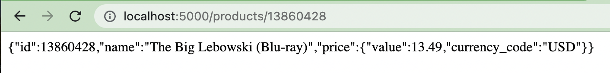
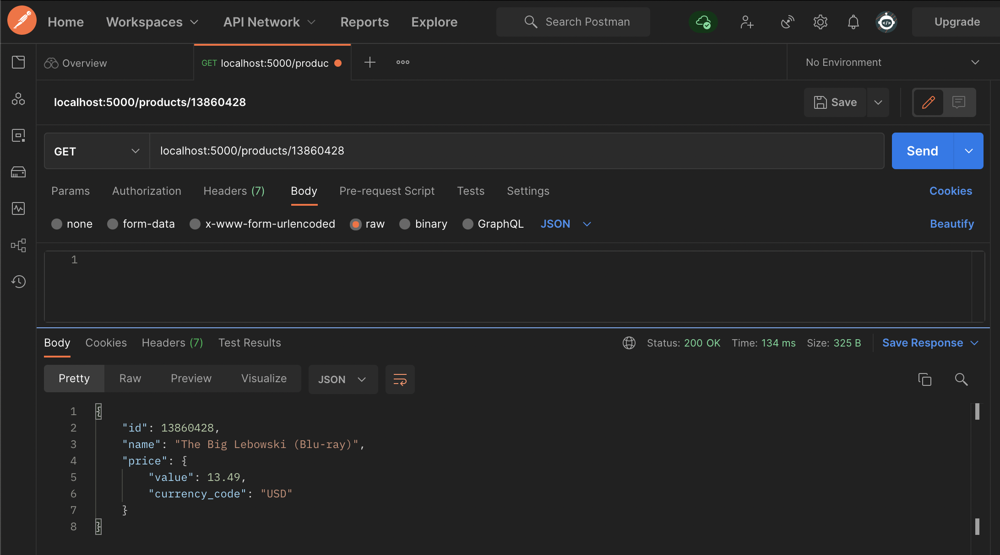

# Technical Assessment Case Study - myRetail RESTful service

myRetail is a rapidly growing company with HQ in Richmond, VA and over 200 stores across the east coast. myRetail wants to make its 
internal data available to any number of client devices, from myRetail.com to native mobile apps. 

The goal for this exercise is to create an end-to-end Proof-of-Concept for a products API, which will aggregate product data from multiple 
sources and return it as JSON to the caller. 

Your goal is to create a RESTful service that can retrieve product and price details by ID. The URL structure is up to you to define, but try to 
follow some sort of logical convention.

Build an application that performs the following actions: 
- Responds to an HTTP GET request at /products/{id} and delivers product data as JSON (where {id} will be a number - example product IDs: 13860428, 54456119, 13264003, 12954218) 
- Example response: { "id": 13860428, "name": "The Big Lebowski (Blu-ray) (Widescreen)", "current_price": { "value": 13.49, "currency_code": "USD" }}
- Performs an HTTP GET to retrieve the product name from an external API. (For this exercise the data will come from 
redsky.target.com, but let’s just pretend this is an internal resource hosted by myRetail) 
- Example: 
https://redsky-uat.perf.target.com/redsky_aggregations/v1/redsky/case_study_v1?key=3yUxt7WltYG7MFKPp7uyELi1K40ad2ys&tcin=13860428
- Reads pricing information from a NoSQL data store and combines it with the product id and name from the HTTP request into a single response. 
- BONUS: Accepts an HTTP PUT request at the same path (/products/{id}), containing a JSON request body similar to the 
GET response, and updates the product’s price in the data store. 


## Installation and Setup

### 1. Clone Project

- Install git. If you do not have git installed, this [link](https://github.com/git-guides/install-git) provides instructions on how to do so.
- Once installed, open your terminal and enter the following command:
```
git clone git@github.com:kbrown55347/myRetail-RESTful-service.git
```
- Open the project in your code editor of choice.

### 2. Node and Nodemon
- Download and install [Node.js](https://nodejs.org/en/download/) if you do not have it already.
- After installation, navigate to a terminal in your project's folder and run the following command to install the project's node dependencies.
```
npm install
```
- Running the server code requires [nodemon](https://nodemon.io/). If you don't already have nodemon, install it globally by entering the following command.
```
npm install nodemon --global
````
- Run the following command to start the server.
```
npm run server
```

### 3. Install and setup [MongoDB](https://www.mongodb.com/)

- If you don't have MongoDB installed, I found the "Installing MongoDB" section of [this resource](https://zellwk.com/blog/local-mongodb/) helpful for the installation process.

- Once installed, enter the following command in your terminal. Keep this window running to work with your local MongoDB.
```
mongod
```

- Open up a new terminal and enter the following command to open up the Mongo Shell.
```
mongo
```

- Through the Mongo Shell, create a new database by entering the following command.
```
use myRetail
```

- To add a collection to the database and an item to the collection, enter the following command.
```
db.products.insertOne({"pid": 13860428, "current_price": {"value": 13.49, "currency_code": "USD"}})
```

### 4. Run the Application

- To run the application, navigate to localhost:5000/products/13860428 in your web browser. The JSON response shown in the screenshot below will be returned which is a combination of the price information from MongoDB and the product name and id retrieved from the external API. 



### 5. Testing with Postman

- Download and install [Postman](https://www.postman.com/downloads/) if you do not have it already. 
- Once installed, open the Postman application. In a new tab, set the request type to GET, and where prompted to add a url, enter in localhost:5000/products/13860428
- Select Body then raw. In the dropdown menu, change Text to JSON. Click Send.
- The following is a screenshot from my own test with Postman.




## Tech Stack

- I used MongoDB (version 5.0.6) since it meets the NoSQL data store requirement. I hadn't used a NoSQL data store before and when researching more about them, I came across a lot of good documentation on MongoDB so I decided to use it. Plus it uses a JSON-like format to store documents.
- I chose to use a combination of Node (version 17.6.0), Express and JavaScript because those are the programming languages I am the most familiar with at this time.
- I used Postman (version 9.14.9) as my API testing tool. 
- I used Git (version 2.30.1) for version control (tracking and managing changes in my code).
- I used Github to host my project so it could be shared with and accessed by others.


